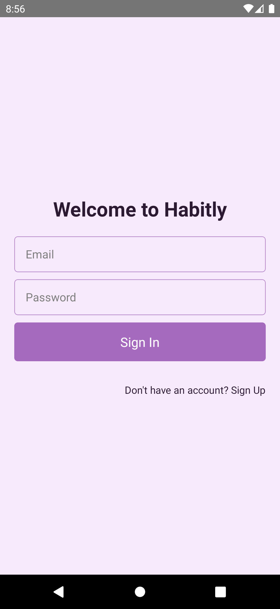
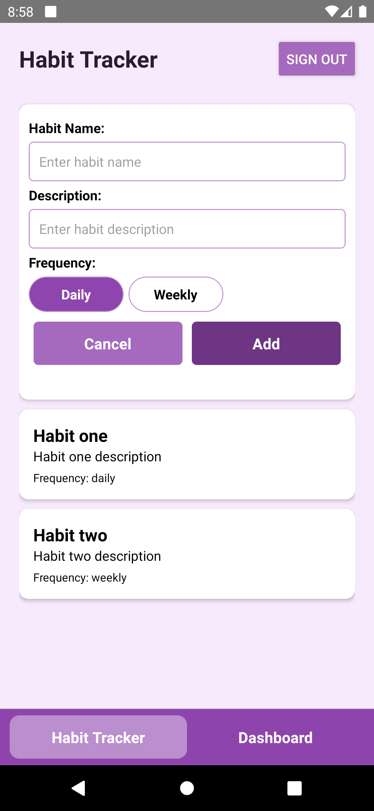
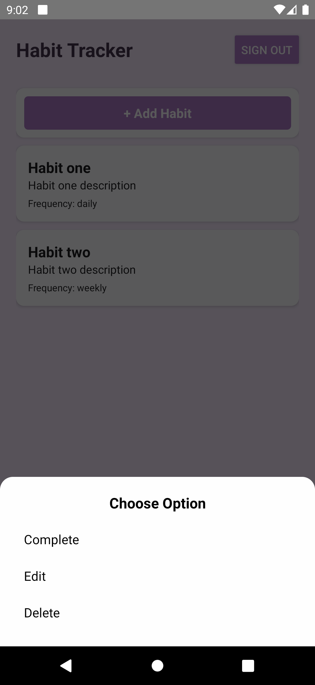
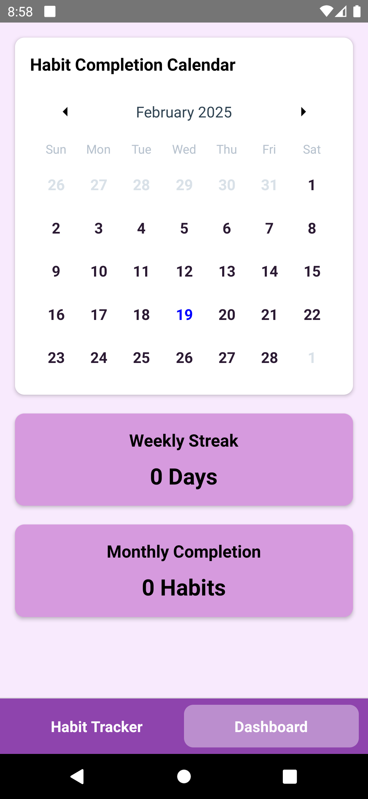
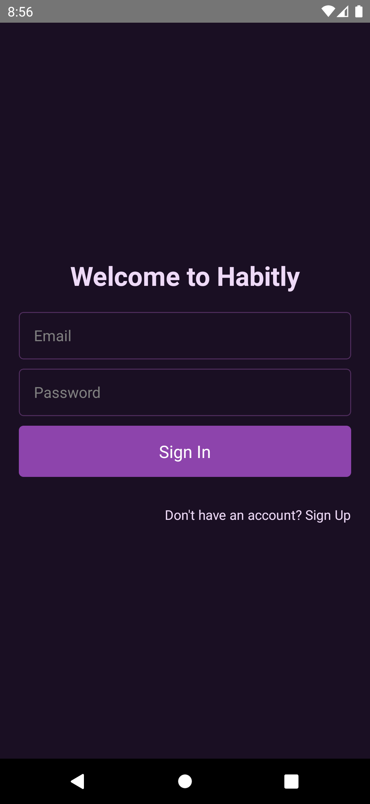
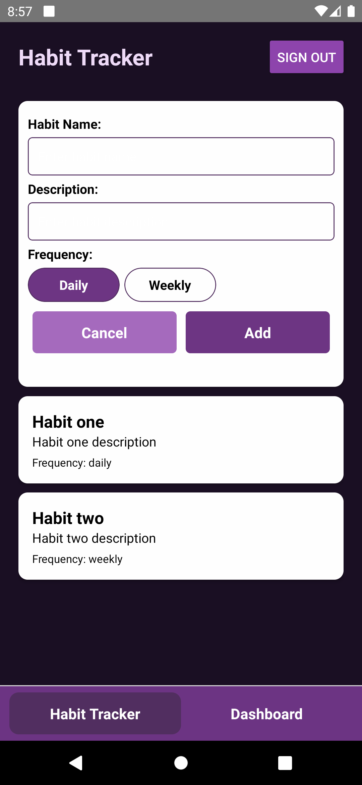
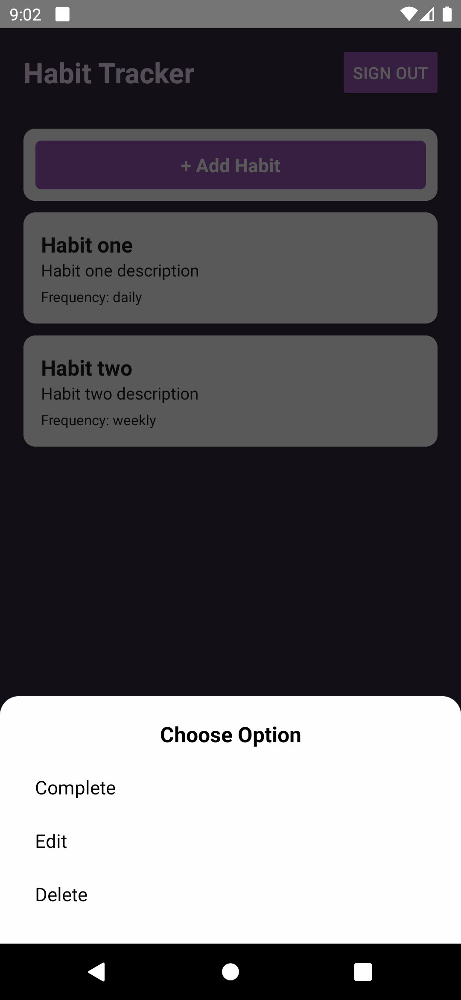
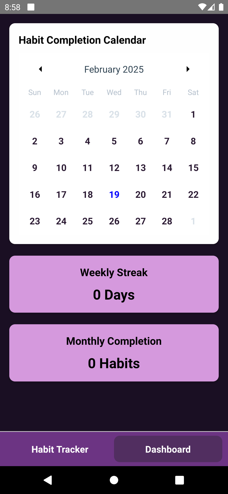

# Habitly - Habit Tracking App

## 📌 Features

### 🔑 Authentication
- Sign in / Sign up using Firebase Authentication
- Error handling for authentication failures
- Sign out functionality to switch users
- Auto-login: If already signed in, the user is redirected to the main page on launch

### 📋 Habit Management
- Add, edit, delete, and mark habit tasks as completed
- Smooth animation for the add habit button

### 📊 Dashboard
- **Calendar View**: Displays completed habits
- **Weekly Streak Indicator**: Tracks ongoing streaks
- **Monthly Completion Stats**: Shows total completed habits in the current month

### 🔔 Notifications
- **Local & Remote Push Notifications**
  - Habit creation notifications
  - 7-day streak achievement notifications

### 🎨 Bonus Features
- **Dark Mode** support 
- **Streak Badges** (e.g., awarded for completing a 7-day streak)
- **Smooth Animations** throughout the app

---

## 🏗️ Folder Structure

```
Habitly/
│── src/
│   ├── constants/       # App-wide constants
│   ├── context/         # React Context API for state management
│   ├── navigation/      # Navigation setup (React Navigation)
│   ├── screens/         # Main UI screens (Dashboard, Habits, Login)
│   ├── services/        # Notification services
│   ├── styles/          # Global styling and themes
│   ├── utils/           # Helper functions & utilities
```

---

## 🛠️ Setup Instructions

### Installation Steps

1. Clone the repository:
   ```sh
   git clone https://github.com/rahual1510/Habitly.git
   cd Habitly
   ```
2. Install dependencies:
   ```sh
   npm install
   ```
3. Run the app:
   - For Android:
     ```sh
     npx react-native run-android
     ```

---

## 🏛️ Architecture Overview

### 🔹 State Management
- **React Context API** is used to manage user data and habit-related state.
- Context Providers:
  - `UserContext` (handles authentication state)
  - `HabitContext` (manages habits and their completion state)

### 🔹 Navigation
- **React Navigation** is used for managing screens.
- **Custom Bottom Bar** navigation is implemented (text-based, no icons).

### 🔹 Database & Storage
- **Firebase Firestore** is used for habit data storage.
- **Firebase Authentication** for user management.
- **Firebase Cloud Messaging** for push notifications.

### 🔹 Animations
- **Reanimated** and **React Native Animated API** are used for smooth UI transitions.

---

## 🔄 Trade-offs & Assumptions

### ⚖️ Trade-offs
- **Context API vs Redux:** Chose Context API for simplicity as Redux was not needed for this scale.

---
### 💡 Light theme






---
### 🌚 Dark theme







---

🚀 **Enjoy tracking your habits with Habitly!**

